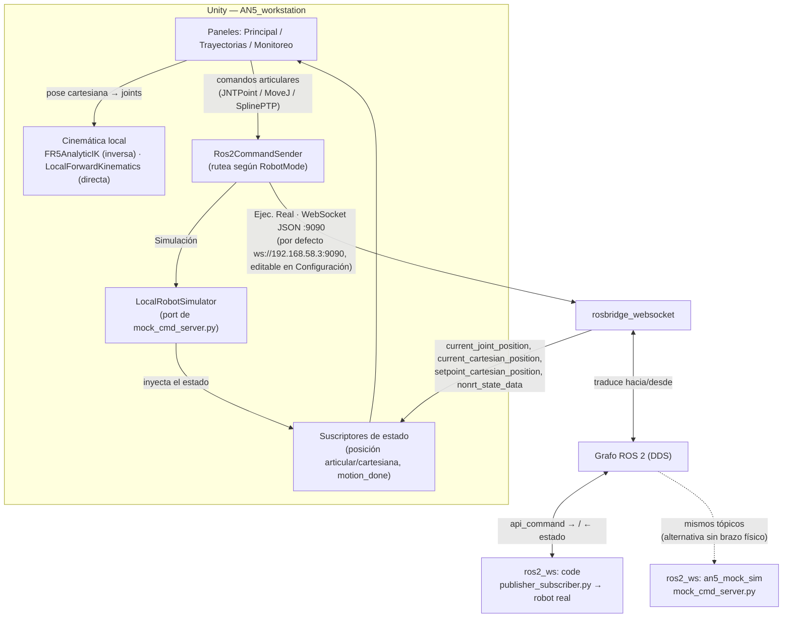

# Project_AN5 — Interfaz Unity + ROS 2 para el brazo AN5/FR5

Proyecto de control y simulación del brazo colaborativo **AN5/FR5v6 (Fairino, 6 DOF)**,
desarrollado en la Universidad del Cauca (grupo GA).

## Versiones

### v2.1 — IK interno y modo Simulación sin ROS (actual)

- **Cinemática inversa interna (`FR5AnalyticIK`).** La IK se resuelve en Unity, en C#,
  con la solución analítica cerrada del FR5v6 (hasta 8 candidatas por pose, cada una
  verificada contra su propia cinemática directa). Ya no hace falta levantar MATLAB
  para el jog cartesiano ni para cargar trayectorias. Entre las candidatas válidas
  elige la más cercana a la pose actual, respeta los límites articulares del URDF y
  descarta las que llevan el codo o la muñeca contra la mesa.
- **Postura "grúa".** El hombro (J2) nunca pasa de −45° y se prefiere el codo arriba
  (J3 > 0), para que el brazo trabaje por encima y no baje hacia la zona de trabajo.
- **Modo Simulación sin ROS (`LocalRobotSimulator`).** El botón Ejec. Real /
  Simulación del encabezado cambia entre el robot físico y un robot simulado que
  corre completo dentro de Unity. Es un port en C# de `mock_cmd_server.py`: usa la
  misma gramática de comandos, la misma interpolación y la misma pose inicial. No
  necesita `ros2_ws`, rosbridge ni MATLAB, y la app arranca en este modo por defecto.
  En Ejec. Real la conexión por ROS 2 funciona igual que en v2.0.
- El cuadro de carga de trayectorias ya no menciona MATLAB, porque el cálculo es local.

### v2.0 — Interfaz Unity + ROS 2 + MATLAB

- Interfaz de operador en Unity con paneles Principal (control articular de los 6
  ejes y lectura cartesiana en vivo), Trayectorias (cola de waypoints, jog cartesiano,
  carga, ejecución y exportación de archivos de trayectoria) y Monitoreo (URDF animado
  en tiempo real, multi-cámara, grabación de video).
- Comunicación con el robot vía ROS 2 (`rosbridge_websocket:9090`), con modo real
  (driver Fairino) y modo simulado (`an5_mock_sim`).
- Cinemática inversa resuelta por MATLAB (`inverse_kinematics.m` /
  `inverse_kinematics_docker.m`) a través del grafo ROS 2. La cinemática directa ya
  se calculaba localmente en Unity (`LocalForwardKinematics.cs`).

| Carpeta | Qué es | README propio |
|---|---|---|
| [`AN5_workstation/`](AN5_workstation/) | Interfaz de operador en Unity: control articular/cartesiano, grabación y reproducción de trayectorias, visualización 3D del URDF en tiempo real. | [`AN5_workstation/README.md`](AN5_workstation/README.md) |
| [`ros2_ws/`](ros2_ws/) | Workspace ROS 2 del robot, con modo real (driver Fairino) y modo **mock** (simulación sin brazo físico) para desarrollar contra Unity sin hardware. | [`ros2_ws/README.md`](ros2_ws/README.md), detalle del mock en [`ros2_ws/src/an5_mock_sim/README.md`](ros2_ws/src/an5_mock_sim/README.md) |
| [`AN5_Matlab/`](AN5_Matlab/) | Scripts MATLAB/Simulink del robot: cinemática directa/inversa (`fr5_fk.m`, `fr5_ik.m`, `inverse_kinematics.m`), generación de trayectorias (`Trayectoria_*.m`), interfaces App Designer (`Interfaz_*.mlapp`) y los assets URDF/mallas de `frcobot_description`. Desde v2.1 la app de Unity ya no lo necesita: la IK se calcula dentro de Unity. | — (sin README propio) |

## Qué está implementado

**Panel Principal** (control en vivo)
- Control articular de los 6 ejes (BASE, SHOULDER, ELBOW, WRIST 1/2/3) con sliders y
  lectura en grados en tiempo real.
- Lectura cartesiana (X, Y, Z, Rx, Ry, Rz) del robot: vía ROS 2 en Ejec. Real, o del
  simulador local en Simulación.
- Seguimiento del efector final (`j6_link`) en el mundo 3D.

**Panel Trayectorias** (cola de puntos y archivos)
- Captura de la configuración articular actual como waypoint, armado de una secuencia,
  previsualización cartesiana de cada punto (por cinemática directa local) y envío de
  la cola completa como trayectoria spline.
- Carga y ejecución de archivos de trayectoria en texto plano (`x,y,z,rx,ry,rz,speed,delay`
  por línea), con pausa/stop/progreso.
- Jog cartesiano: entrada manual de X/Y/Z/Rx/Ry/Rz que resuelve la cinemática inversa
  localmente (`FR5AnalyticIK`) y aplica el resultado a los joints.
- Exportación de la cola actual a un `.txt` con marca de tiempo en `routines/`.

  **NOTA:** Al cargar una trayectoria, cada punto cartesiano se convierte a posiciones
  articulares con la IK interna de Unity antes de ejecutar. Si algún punto no tiene
  solución (fuera de alcance, fuera de límites articulares o con el brazo contra la
  mesa), el archivo se rechaza completo; la consola de Unity indica qué punto falló y
  por qué.

**Panel Monitoreo** (visualización)
- Modelo URDF del FR5v6 animado en tiempo real a partir de los datos articulares
  entrantes.
- Multi-cámara (teclas 1/2/3), órbita/pan (WASD + drag, flechas + click derecho) y zoom.
- Grabador de pantalla del Game View a AVI Motion-JPEG.

**Modo Simulación local (`LocalRobotSimulator`)**
- Botón Ejec. Real / Simulación en el encabezado. La app arranca en Simulación.
- En Simulación todo corre dentro de Unity: comandos, interpolación del movimiento,
  estado articular/cartesiano e IK/FK. No hace falta ROS 2, rosbridge ni MATLAB.
- Es un port en C# de `mock_cmd_server.py` (misma gramática de comandos, misma
  interpolación y misma pose inicial), así que todos los paneles se comportan igual
  que contra el mock de ROS 2.

**Simulación ROS 2 (`an5_mock_sim`)** — alternativa por ROS, para probar el camino
completo de Ejec. Real sin el brazo físico
- Reemplaza al driver real (`ros2_cmd_server`) sin tocarlo: mismo servicio
  (`/FR_ROS_API_service`), misma gramática de comandos (`JNTPoint`, `MoveJ`, `MoveL`,
  `SplineStart/SplinePTP/SplineEnd`, `GET`, `StopMotion`, etc.).
- Interpola el movimiento articular (50 Hz por defecto, easing configurable) y calcula
  la pose cartesiana por cinemática **directa** a partir del URDF.
- Publica `/joint_states`, `nonrt_state_data`, y los tópicos CSV que Unity realmente
  consume (`current_joint_position`, `current_cartesian_position`,
  `setpoint_cartesian_position`).
- Permite alternar modo real/simulado sin cambiar nada en Unity (mismo
  `rosbridge_websocket:9090` en ambos casos).

## Arquitectura: cómo se conectan Unity y ROS 2



Puntos clave:

- **La cinemática inversa y la directa se calculan dentro de Unity** (`FR5AnalyticIK`,
  `LocalForwardKinematics`), en los dos modos. La app solo manda al robot comandos en
  espacio articular (`JNTPoint`/`MoveJ`/`SplinePTP`), ya resueltos.
- **En Simulación no hay ROS.** `Ros2CommandSender` le entrega cada comando a
  `LocalRobotSimulator`, que simula el movimiento y le inyecta el estado a los mismos
  suscriptores que en modo real reciben los tópicos de ROS 2. `RosConnector` queda
  desconectado.
- **En Ejec. Real** Unity se conecta a `rosbridge_websocket` (puerto 9090) y de ahí al
  driver del robot físico, igual que en v2.0. La IP y el puerto se pueden cambiar en el
  panel Configuración, por ejemplo para apuntar a `an5_mock_sim` corriendo en
  `localhost` y probar el camino ROS completo sin el brazo.
- MATLAB ya no forma parte del flujo de la app.

## Requisitos

### Unity (`AN5_workstation/`)
- Unity 6 (la versión del editor es 6000.4.6f1). Es posible utilizar otra versión de editor, pero usualmente conlleva a conflictos en funciones o módulos deshabilitados.

### ROS 2 (`ros2_ws/`)
- Ubuntu 22.04 + ROS 2 **Humble** (probado)
- Alternativa sin instalar ROS 2 en el host: **Docker** (`docker compose up --build`
  dentro de `ros2_ws/`), ver su README.
- No requiere el robot físico para el modo simulado (`sim.launch.py`); el modo real
  (`real.launch.py`) sí necesita el controlador FR5/AN5 accesible en la red.

### MATLAB (`AN5_Matlab/`) — opcional
- **No se necesita para usar la app.** Desde v2.1 la IK se calcula dentro de Unity, así
  que no hay que levantar ningún script de MATLAB para el jog cartesiano ni para cargar
  trayectorias.
- `AN5_Matlab/` se conserva para análisis y desarrollo fuera de Unity (cinemática en
  `fr5_fk.m`/`fr5_ik.m`, generación de trayectorias `Trayectoria_*.m`, interfaces App
  Designer) y para el flujo de v2.0, en el que `inverse_kinematics.m` (o
  `inverse_kinematics_docker.m` con `ros2_ws` en Docker) resolvía la IK por ROS 2 en
  `input_cartesian_position → output_joint_position`. La app v2.1 ya no usa esos tópicos.
- Probado con R2023b+ (con los toolboxes de robótica y ROS). Incluye su propia copia de
  `frcobot_description` (URDF + mallas), los mismos modelos que usa Unity, versionados
  acá vía Git LFS (ver más abajo).

### Git LFS
Este repo usa **Git LFS** para modelos 3D, texturas, audio/video y otros binarios
pesados (`.gitattributes` en la raíz y en `AN5_workstation/`). Instalalo **antes** de
clonar:

```bash
sudo apt install git-lfs      # o el instalador de tu SO
git lfs install
git clone git@github.com:MooZ91/Project_AN5.git
```

Si ya clonaste sin tener `git-lfs` instalado, los archivos grandes van a aparecer
como punteros de texto en vez de contenido real — correr `git lfs install && git lfs pull`
para traerlos. Esto es lo que suele romper Unity al portar el proyecto a otra máquina:
si los meshes/texturas quedan como punteros, el importer arroja una catarata de errores
inconexos en la consola. `AN5_workstation/` trae un chequeo automático para esto (ver
[`AN5_workstation/README.md`](AN5_workstation/README.md#git-lfs)): al abrir el proyecto
detecta punteros sin traer y ofrece ejecutar `git lfs pull`.

## Puesta en marcha rápida

**Solo Unity (modo Simulación, sin ROS ni MATLAB):**

```bash
# 1. Clonar (con Git LFS ya instalado, ver arriba)
git clone git@github.com:MooZ91/Project_AN5.git

# 2. Abrir AN5_workstation/ en Unity 6000.4.6f1, abrir la escena AN5_sim y entrar en
#    Play mode. La app arranca en Simulación: el robot simulado corre dentro de Unity.
```

**Con ROS 2 (Ejec. Real, contra el robot o contra el mock):**

```bash
cd Project_AN5/ros2_ws
rosdep install --from-paths src --ignore-src -r -y
colcon build
source install/setup.bash
ros2 launch an5_mock_sim sim.launch.py    # o real.launch.py con el robot físico

# En Unity: botón Ejec. Real. Si rosbridge no está en 192.168.58.3 (por ejemplo, el
# mock en este mismo equipo), cambiar IP/Puerto en el panel Configuración.
```

## Notas conocidas

- No ejecutar `sim.launch.py` y `real.launch.py` al mismo tiempo: compiten por el mismo
  servicio y los mismos tópicos de estado.
- El mock (`mock_cmd_server.py`) y el modo Simulación de Unity simulan el movimiento
  de forma simplificada (sin colisión real, sin distinguir forma de trayectoria entre
  `MoveJ`/`MoveL`); no reemplazan la validación del controlador real.
- La IK interna solo protege contra límites articulares y contra el codo/muñeca
  bajo la mesa (más la postura grúa); no modela colisiones con otros objetos de la
  celda.

## Licencia

`ros2_ws/` se distribuye bajo Apache License 2.0 (ver [`ros2_ws/LICENSE`](ros2_ws/LICENSE));
incluye contenido de terceros (Fair Innovation, `frcobot_description`) también Apache 2.0.
`AN5_workstation/` no trae licencia propia declarada — revisar antes de redistribuir.
